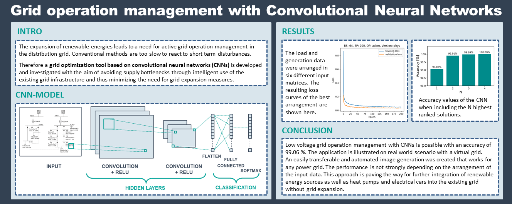
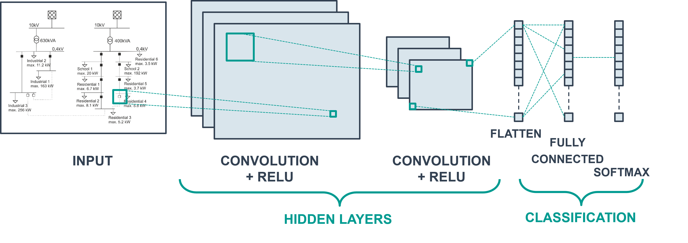

# Power Grid Operation Management with Convolutional Neural Networks

[](https://img.shields.io/badge/python-3.10.*-violet)
[](LICENSE)
[](https://img.shields.io/badge/Project-AI4Grids-%23fcba03?link=https%3A%2F%2Fwww.htwg-konstanz.de%2Fhochschule%2Fprojekte%2Fai4grids%2Fueber-ai4grids%2F)

This project is used for the development and investigation of a grid optimization tool based on convolutional neural networks (CNNs) with the aim of avoiding supply bottlenecks through intelligent use of the existing grid infrastructure and thus minimizing the need for grid expansion measures.

This project is developed and maintained by [Manuela Linke](https://www.researchgate.net/profile/Manuela-Linke) at the [HTWG Konstanz](https://www.htwg-konstanz.de/). Parts of the code were developed by [Tobias Meßmer](https://www.researchgate.net/profile/Tobias-Messmer-2) and [Gabriel Micard](https://www.researchgate.net/profile/Gabriel-Micard). 

This research was funded by the [Federal Ministry for the Environment, Nature Conservation, Nuclear Safety and Consumer Protection (BMUV)](https://www.bmuv.de/) based on a resolution of the German Bundestag as part of the Reasearch Project [AI4Grids](https://www.htwg-konstanz.de/hochschule/projekte/ai4grids/ueber-ai4grids/).



## Highlights

-   Grid operation management based on convolutional neural networks with a maximum accuracy of 99.06 %
-   Application illustrated on real world scenario with virtual grid
-   Two approaches investigated for the implementation of input data
-   Paving the way for further integration of renewable energy sources as well as heat pumps and electrical cars into the existing grid without grid expansion

## For using your own data: 
For using these scripts you need to take care, that 
- the order of nodes in you pandapower grid is the same as the order of loads in the grid
- If you have nodes that are not connected to a load you need to implement an exeption
- generations are considered as negative loads
- loads has to have an additional row for p_max

## Installation

Create Environment:
```conda create -n cnn_regler python=3.10.*```
```pip install -r requirements.txt```

For using the script to generate the training data: 

```python 2_Generate_Training_Data.py . data --max_workers=30```

Note: adjust maximum number of workers to you number of kernels

## Screenshots

The virtual grid used in this project:


Flowchart of the training data generation algorithm:




## Generated Datasets

The Results presented in the associated paper are based oon the generated training datasets with the timestamp:
-   2024-03-22_13-06-27 (smaller dataset to comapre the approaches)
-   2024-03-25_16-56-21 (bigger dataset used for extended training of the physical approach)

## Dependencies

This project is written and tested to be compatible with Python 3.10.

It leans heavily on the following Python packages:

-   [pandapower](http://pandapower.org/) for power system modeling, analysis and optimization. 
-   [numpy](http://www.numpy.org/) for calculations, such as linear algebra and matrix calculations
-   [matplotlib](https://matplotlib.org/) for plotting
-   [tensorflow](https://www.tensorflow.org/) and Keras (https://keras.io/) for the CNN model 
-   [jupyterlab](https://jupyter.org/) as interactive development environment  


## Contributing and Support

We warmly invite anyone interested in contributing to this project. If you have any ideas, suggestions, or encounter any problems, please feel free to contact us.


## Citing 

If you use this project for your research,  we kindly request that you cite the following paper:

-   M. Linke, T. Messmer, G. Micard, G. Schubert, [Power Grid Operation Management with Convolutional Neural Networks](), 2024, [Smart Energy](https://www.sciencedirect.com/journal/smart-energy), ..


Please use the following BibTeX:

    @article{Linke2024,
       author = {M. Linke and T. Messmer and G. Micard and G. Schubert},
       title = {{Power Grid Operation Management with Convolutional Neural Networks}},
       journal = {Smart Energy},
       volume = {},
       issue = {},
       number = {},
       year = {2024},
       eprint = {},
       url = {},
       doi = {}
    }


# Licence

This project is licensed under the open source [xx License]().